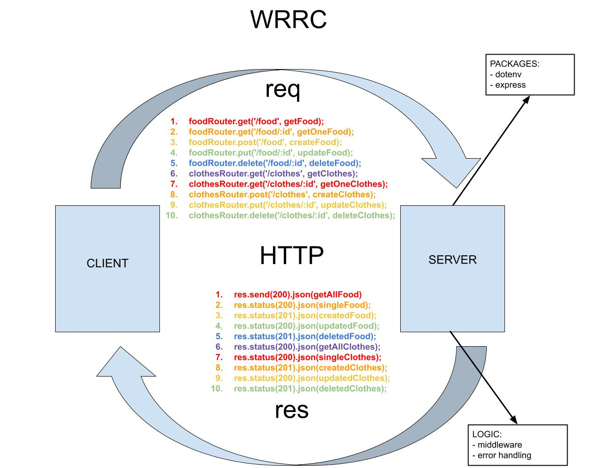

# Lab 03 - 401 JavaScript

# Basic Api Server

## Author: Lydia Minehan-Tubic

### Links and Resources

✨ [Deployed Heroku Site - route /food](https://lydia-basic-api-server.herokuapp.com/food)

✨ [Deployed Heroku Site - route /clothes](https://lydia-basic-api-server.herokuapp.com/clothes)

✨ [GitHub Actions](https://github.com/LydiaMT/basic-api-server/actions)

✨ [Pull Request](https://github.com/LydiaMT/basic-api-server/pull/2)

Visit [Swagger](https://inspector.swagger.io/builder) and input https://lydia-basic-api-server.herokuapp.com/clothes or https://lydia-basic-api-server.herokuapp.com/food to create, update, or delete food or clothing items. 

### Setup

- Clone down to your device
- In the root directory, run `npm install` to install node modules
- Create a `.env` file and add a port variable to your environment
- Run `nodemon` to see your live server via local host in your browser. 

### Test

- In the command line at the root directory, `run npm test` to make sure all test are passing as expected.

### Architecture

```git
├── .gitignore
├── .eslintrc.json
├── __tests__
│   ├── server.test.js
│   ├── logger.test.js
├── src
│   ├── error-handlers
│   │   ├── 404.js
│   │   ├── 500.js
│   ├── middleware
│   │   ├── logger.js
│   │   ├── validator.js
│   ├── models
│   │   ├── food.js
│   │   ├── clothes.js
│   ├── routes
│   │   ├── food.js
│   │   ├── clothes.js
│   ├── server.js
├── index.js
└── package.json
```

### UML / WRRC


